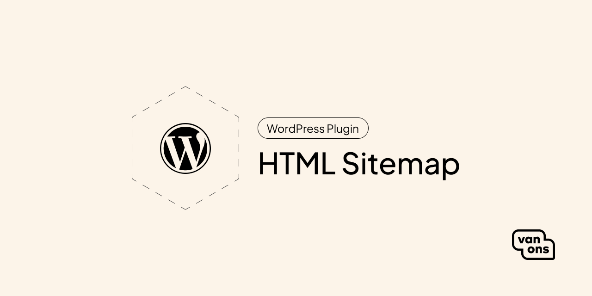

# VO HTML Sitemap

<!-- BADGES -->

A wordpress plugin to add a html sitemap to your site

## Quick start

Download the latest release from the [releases page](https://github.com/VanOns/vo-html-sitemap/releases) and install it in your WordPress admin panel.
Select the page you want to display the sitemap on in the settings page and visit that page to view your sitemap!

### Installation

1. Download the latest version release from the [releases page](https://github.com/VanOns/vo-html-sitemap/releases)
2. Go to your WordPress admin panel and navigate to `Plugins` -> `Add New`
3. Click `Upload Plugin` and select the downloaded zip file
4. Click `Install Now` and then `Activate Plugin`

### Usage

1. Go to `Settings` -> `HTML Sitemap` to configure on which page the sitemap should be displayed, we recommend using a page dedicated to displaying the sitemap.
2. Flush your permalinks by going to `Settings` -> `Permalinks` and clicking `Save Changes`
3. Visit the page you selected in step 1 to view your sitemap!
4. We recommend adding the page to your footer menu so search engines can easily find it.

## Issues
This plugin uses a lot of rewrite rules to make the sitemap work. If you have any issues with the sitemap not working, please make sure you have flushed your permalinks by going to `Settings` -> `Permalinks` and clicking `Save Changes`.

## Contributing

Please see [contributing] for more information about how you can contribute.

## Changelog

Please see [changelog] for more information about what has changed recently.

## Upgrading

Please see [upgrading] for more information about how to upgrade.

## Security

Please see [security] for more information about how we deal with security.

## Credits

We would like to thank the following contributors for their contributions to this project:

- [All Contributors][all-contributors]

## License

The scripts and documentation in this project are released under the [MIT License][license].

---

[documentation]: docs
[contributing]: CONTRIBUTING.md
[changelog]: CHANGELOG.md
[upgrading]: UPGRADING.md
[security]: SECURITY.md
[email]: mailto:opensource@van-ons.nl
[all-contributors]: ../../contributors
[license]: LICENSE.md
