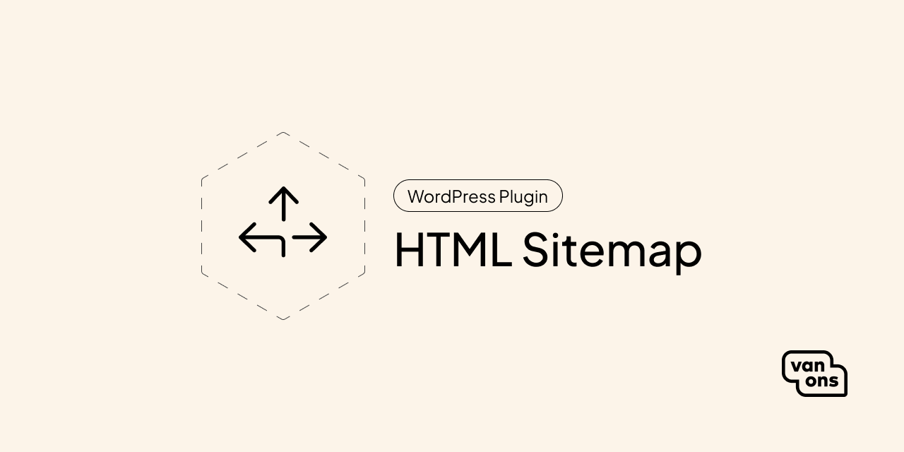

# VO HTML Sitemap

<!-- BADGES -->

A wordpress plugin to add a html sitemap to your site

## Quick start

### Installation

TODO: Add installation

### Usage

TODO: Add usage, show settings page.

## Documentation

Please see the [documentation] for detailed information about installation and usage.

## Contributing

Please see [contributing] for more information about how you can contribute.

## Changelog

Please see [changelog] for more information about what has changed recently.

## Upgrading

Please see [upgrading] for more information about how to upgrade.

## Security

Please see [security] for more information about how we deal with security.

## Credits

We would like to thank the following contributors for their contributions to this project:

- [All Contributors][all-contributors]

## License

The scripts and documentation in this project are released under the [MIT License][license].

---

[documentation]: docs
[contributing]: CONTRIBUTING.md
[changelog]: CHANGELOG.md
[upgrading]: UPGRADING.md
[security]: SECURITY.md
[email]: mailto:opensource@van-ons.nl
[all-contributors]: ../../contributors
[license]: LICENSE.md
